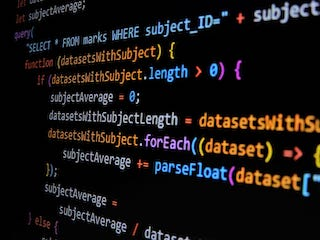

*TypeScript feels both foreign and familiar, like meeting a distant cousin who shares many traits with someone you know well.*

  As a newcomer to TypeScript, I’m intrigued by how closely it resembles JavaScript—almost as if they are siblings or perhaps just very close cousins. In this learning journey, I've encountered “WOD’s” or Workouts of the Day, which are a key part of the Athletic Software Engineering approach. Just like a workout, WOD’s push limits and challenge us to solve problems efficiently and correctly under time constraints. 

## Bridging the Gap: TypeScript vs. JavaScript

  When comparing TypeScript to other programming languages I've worked with, its close relationship with JavaScript makes it relatively approachable. The addition of static types and interfaces in TypeScript adds a layer of difficulty that can enhance code reliability and maintainability, which JavaScript doesn't have as naturally. This is especially useful for large projects or when working in teams, where TypeScript's type-checking helps catch errors early on and offers better documentation with types.
  TypeScript also builds on and extends many features that I learned during my prior experience with ES6, such as arrow functions, classes, and modules. However, TypeScript introduces additional concepts like generics and type inference, which offer more powerful tools for creating flexible, cleaner, and reusable code.

## From a Different Perspective 

  Evaluating TypeScript from a software engineering perspective, it seems like a highly beneficial language. Its strong typing system and tooling support contribute to a more organized and predictable codebase, which can be a significant advantage when working with more complex projects. The ability to catch potential issues at compile-time rather than runtime can improve overall code quality and reduce debugging time.

  
  As for the Athletic Software Engineering approach and its practice WODs, I find them to be an effective method for learning. The time constraints and problem-solving exercises simulate real-world coding challenges I may face later in my career. Although the time pressure can be stressful, it also mirrors the urgency of real-world development tasks, which makes the learning experience feel more relevant and intense. The style of learning through WODs is definitely motivating, providing clear goals and immediate feedback. The video demonstrations and timed challenges encourage a deeper understanding of the material. Overall, I believe this method will work for me, as it combines theoretical knowledge with practical application in a way that aligns with both my learning preferences and professional goals.
