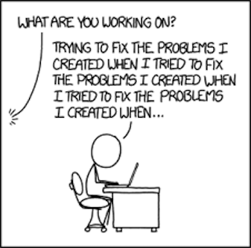

## Navigating the Labyrinth

  When I first encountered software engineering, it felt like stepping into a labyrinth of complexity and code. The seemingly endless lines of programming languages and intricate systems were very intimidating. But as I ventured deeper, a world of possibility began to unfold, revealing how this field could intertwine with my passions and creative pursuits.

## The Puzzle of Progress

  I remember a moment during a project in a coding class when the challenge of debugging a stubborn piece of code turned into a breakthrough. It was like the feeling of solving a 3000 piece puzzle, each piece fitting together to reveal a working program. That moment sparked a realization; software engineering isn't just about writing code, it's about creating solutions, innovating, and seeing ideas come to life. This realization was a turning point for me, transforming software engineering from a daunting task into an exciting opportunity to blend technology with creativity. 

## Designing Dreams

  As I continue my studies, I'm drawn to how software engineering can be a canvas for artistic expression. I'm fascinated by the potential to design interactive experiences and user interfaces that are both functional and visually compelling. The idea of creating software that not only solves problems but also delights and engages users is what really puts the cherry on the cake for me. I envision myself developing applications that are intuitive and aesthetically pleasing, merging technical skill with artistic flair.

*"Software is a great combination between artistry and engineering." – Bill Gates*

## Crafting the Future

  Looking ahead, I'm eager to dive deeper into software engineering, exploring new tools and techniques to enhance my abilities. I want to master the art of building robust systems and crafting innovative solutions that stand out in the digital world. Each challenge and project is an opportunity to grow and discover new aspects of this dynamic field, and I'm excited to see where this journey will take me.
