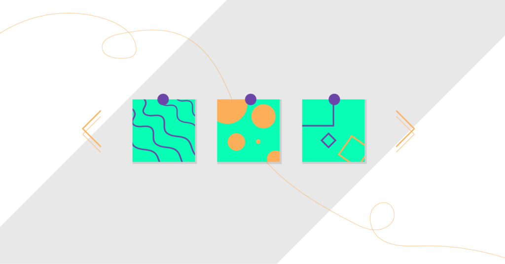

#Turning Code into a Smooth Running Machine

Imagine building a house without a blueprint. You'll most likely end up with crooked walls, mismatched rooms, and structure that will probably fall apart. Same when building Leogs, without the building instuctions its very tough to complete. In design development, design patterns are like these important blueprints or instructions. They are solutions to common challenges and help developers create efficient and flexible software. A project that I worked on called BowFolios would be a great example of how these design patterns transform a jumble of code into a system that runs smoothly. 

##Cloning with Flexibility
When thinking of prototypes, try to think of them as a template that allows new objects to inherit characteristics with ease. In BowFolios, this happens in its collection classes within the API directory, which basically means that when a new object (like a user profile) is created it can quickly pick up any pre-defined behaviors without starting from scratch since they are cloned from an existing prototype. For example, say you have a “Profile” object defined, it will then carry forward the behaviors of its prototype and allow for shared methods/properties. This is like having a cooking recipe that you can easily modify and adapt to any new factors. 

##Staying in Sync
The Observer Pattern is an important part of how a website instantly stays up to date for BowFolios. In Next.js this happens in two main ways
-Server Side Rendering(SSR)
  -Web pages will automatically fetch the latest information right when someone requests a page. For example, when you visit the profiles page, it will then immediately pull whatever the most recent profile data from the database is. Any changes that are made in the database will also show up right away on the webpage.
  -Automatic Background Updates aka Incremental Static Regeneration
For pages that might not change as often will be regenerated by the website automatically in the background. This means that users will always see the most fresh & current information without have to manually refresh. 

Smart Routing
Next.js uses a pretty cool routing system where each web page file automatically becomes a specific route. The system knows exactly where to find and display the information which can be very helpful if someone is requesting a specific profile page. This exemplifies the Front Controller pattern because it centralizes all the handling of the user requests. For example, /profiles/[id].js could act as the front controller for a profile page, retrieving and rendering data for the profile ID included in the URL.
