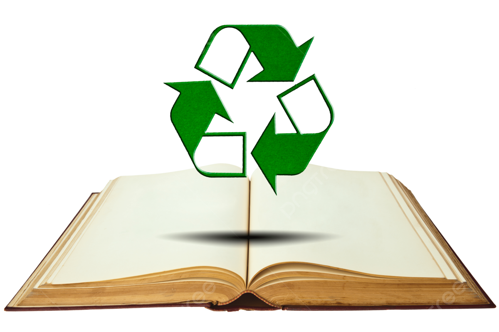

## Project Idea/Solution
* By Chiara Duyn, Aaron Huang, Justin Kugiyama *

   A campus wide marketplace where students can list their used textbooks for sale or rent to other students. When students list their textbooks, they can specify whether they want to sell or rent, and also give the condition and price. Students will be able to search through the site to browse listings based on course, departments or book title. 

## The problem

  Create a sustainable solution, help students save money while reducing textbook waste during their academic career.

## Special Sauce

   There will be some sort of reputation system so that the more transactions a student completes, the higher seller rating they can get.

## Case Ideas

-New user gets to the landing page, logs in, and searches for a specific textbook.                       
-Logged in user finds a textbook, and messages the seller to negotiate a price.                            
-Logged in user goes to the selling page and uploads a textbook to sell.                                 
-Logged in user responds to another student inquiring about a certain textbook.

## Beyond the Basics

Option to enable notifications for when a book is available.
