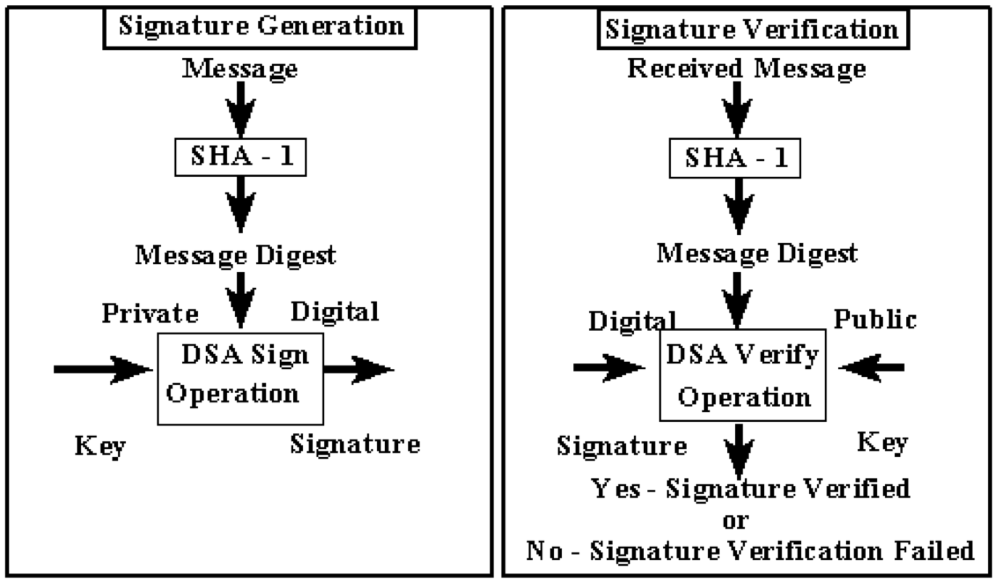

  
  

In this project, I developed a complete SHA-1 hashing algorithm from scratch using C and is used to create a compact representation of a message (also known as a message digest).

It is a requirement when using the Digital Signature Algorithm (DSA), as defined by the Digital Signature Standard (DSS), and is mandated for Federal applications that need a secure hash function. Both the sender and receiver utilize SHA-1 for generating and verifying digital signatures. This standard applies to all Federal agencies for protecting unclassified information, and private and commercial entities are encouraged to adopt it as well.

SHA-1 can be used with DSA in scenarios such as email, electronic funds transfer, software distribution, data storage, and other areas where data integrity and authentication are critical. It is also suitable for generating a compact representation of a message whenever needed. 

For my specific implementation of the SHA-1 hashing algorithm, I utilized three files named a.txt, abc.txt, and alpha.txt, each containing distinct strings. My task involved converting the contents of these files into various formats: hexadecimal, binary, and individual bits. I converted the raw string data into hexadecimal format for a more readable and compact representation, binary format to understand the underlying bit structure, and individual bits for a granular view of the data. Each file provided a different message digest, illustrating how SHA-1 can be used to handle various data types and ensure their integrity.

You can learn more about the SHA-1 hashing algorithm [here](https://csrc.nist.gov/pubs/fips/180-1/final).
