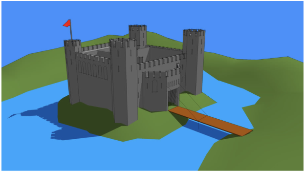

  
  

For Cybersecurity Awareness Month, I decided to create a story called "The Princess and Her Castle" to explain cybersecurity concepts. This story is intended for individuals without a background in the field.

Before the story begins, the castle and its functions must be established.
The moat is meant to keep the bad guys from reaching the castle. Think of it as URL filtering or our network perimeter, designed to slow down hackers.
The outer wall, equipped with a firewall and Intrusion Prevention System (IPS), acts like a gate surrounding the castle, providing an additional layer of security. Just as the wall’s gates allow or deny access, firewalls use rules to permit harmless traffic and block unwanted visitors.
The knights guard the castle from threats both inside and outside the walls. Similarly, anti-virus software on a computer prevents attacks from entering or detects and eliminates threats within the device.
The royals and subjects represent students, employees, or any individuals. It's crucial for everyone to understand important rules to keep hackers at bay.

*Now, for the story:*

There was once a princess who lived happily in her castle, serving as the head of security (like a CISO). Her castle was the only one in the countryside, where she hid all her treasure. Not only was there treasure, but this was also where the royals, subjects, and members of the castle lived. Security was never her top concern until the bad guys took notice and started taking advantage. They would sneak in through the front door and steal what was inside. The situation worsened when the pandemic hit.

With the pandemic in full effect, all members of the castle dispersed to prevent the virus from spreading. This represents how everyone started working remotely. The princess could no longer oversee everyone at home, so she decided to build a watchtower for her head knight to report back to her on what he saw (similar to Azure Sentinel SIEM). Now, the princess could prevent bad guys from stealing treasure or attacking people at home.

In present day, the members of the castle working from home are being attacked by bad guys (like individuals receiving cyberattacks due to increased attack surfaces). The head knight notices this, reports it to the princess, and sends out other knights to protect the homes of castle members (akin to Microsoft Defender providing endpoint protection).

Realizing that keeping all the treasure in one castle is risky, the princess decides to spread her treasure across multiple castles around the countryside (analogous to spreading data across multiple cloud vendors rather than relying solely on an on-premise network perimeter). Though no castle, treasure, or person is 100% safe from unfortunate events, the princess hopes to mitigate risks by performing weekly searches (threat hunting) and maintaining good communication with all members of the castle. Unfortunately, this takes a toll on her sleep, but she wouldn't have it any other way.

The End!
